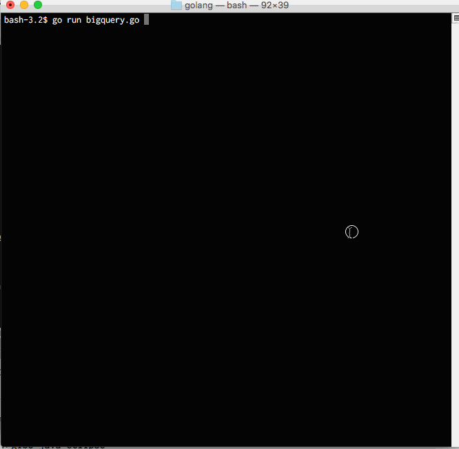
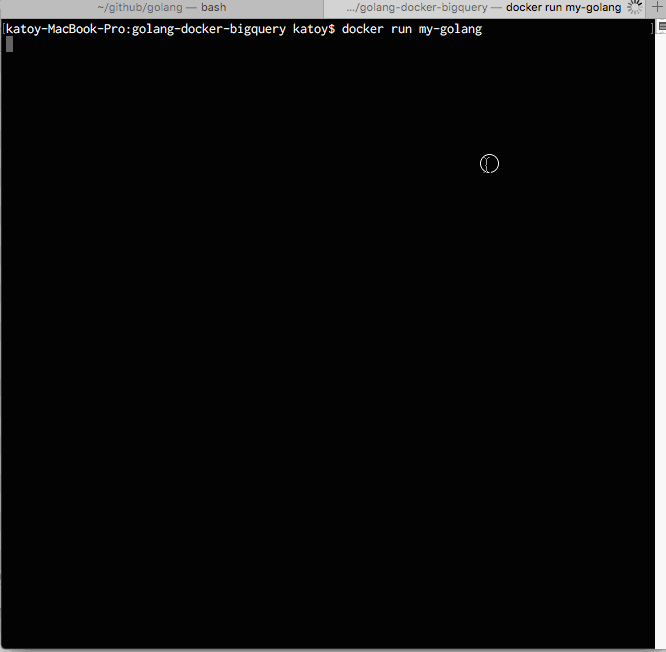

# 目的

golang で BigQuery API を利用してみる。
さらに、そのプログラムを docker で動作させる。

# ためした環境

Mac OS X 10.11.6
go 1.7.1 darwin/amd64
docker version 1.12.0
docker-machine version 0.8.0,

# 準備

* Googleサービスを使う準備が必要です。
[http://www.task-notes.com/entry/20151019/1445223600](http://www.task-notes.com/entry/20151019/1445223600) の
サービスアカウントを使った認証　の章などを参照して、サービスアカウントでの認証のためのファイルを download しておく。
(ファイル名は client.json とする)


* brew をつかって go をインストールする。
```
$ brew install go
```

* docker-macine をインストールする。
[docker-machine を使って boot2docker から脱却する](http://qiita.com/voluntas/items/7bcc9402b51a2ba99096) などを参照して
docker-machine　をインストールする。

# 実行 1

MacOS 上で、普通に go スクリプトを実行する。

```
$ go get -u golang.org/x/net/context
$ go get -u golang.org/x/oauth2/google
$ go get -u google.golang.org/api/storage/...
$ go get -u google.golang.org/api/bigquery/...

$ go run bigquery.go
```



# 実行 2

上のプログラムを docker で実行する。

## 準備

```
$ docker-machine env default
$ eval $(docker-machine env default)
```

## イメージの作成

```
$ docker build -t my-golang .
```

## イメージの実行

```
$ docker run my-golang
```


# TODO

現状では、 go コードの変更の度に docker イメージをつくりなおす必要がある。
go get は数分かかる。
そこで、docker を作り直さずに、変更した go コードを docker で run させる方法を修得することが必要。

参考
- http://blog.flup.jp/2016/02/18/golang_docker_hot_reload/ Docker内のGo製Webアプリをソース変更後リロードするだけで確認できるようにする

# その他

See
- http://blog.flup.jp/2016/02/18/golang_docker_hot_reload/

- http://knightso.hateblo.jp/entry/2014/07/04/091610  Google App Engine for GoからBigQuery APIを使ってみる (2014-07-04)

- http://qiita.com/najeira/items/331d5d691bb14a38c26b Go言語からBigQueryのAPIを使う

- http://qiita.com/najeira/items/8310fecf4b70c918f855 Go言語でBigQueryのクエリを実行してみる

- https://hub.docker.com/_/golang/  Supported tags and respective Dockerfile links

- http://girigiribauer.com/archives/20161003/  Golang で DB が簡単に扱える自作コマンドを作ってみた

- http://qiita.com/tmknom/items/c4bcebe17d25381fa45d 気付いたら.gitignoreはgiboで自動生成する時代になっていた
